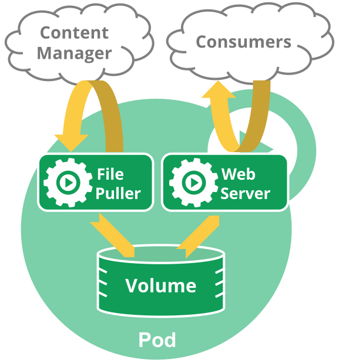

# Pod

*Pod*是k8s中可操作的最小计算单元。

- [Pod是啥](#Pod是啥)
- [为啥要闹Pod](#为啥要闹Pod)
- [用处](#用处)
- [其他方案（就是为了突显一下Pod）](#其他方案)
- [Pod持久化（或者说根本不可能持久化）](#Pod持久化（或者说没有持久化）)
- [Pod结束状态](#Pod结束状态)
- [特权模式](#特权模式)
- [API对象](#API对象)

## Pod是啥

一个*Pod*，就像豌豆荚或者鲸鱼荚，就是一组[容器](../../概要/Kubernetes是啥？.md)，它们共享存储/网络，通过一份声明来定义容器如何运行。这里提到的豌豆荚和鲸鱼荚可能不太好理解，说起豌豆荚，你可能会想到应用商店，那我们就换个词：[毛豆](https://baike.baidu.com/item/%E6%AF%9B%E8%B1%86/65885?fr=aladdin)，这玩意你吃过吧，然后你想想毛豆那个样子，一层皮里面包着一个或者多个豆子，这个豆子就相当于容器，外头那层皮就相当于Pod。至于鲸鱼荚，猛的一看，以为我可能打错字了，感觉根本没有这么一个词，的确，你去百度也百度不到这个词，去谷歌也谷歌不到，因为这个词是老外发明的，并且很小众，是专门研究鲸鱼领域的一个词儿，我们就不说荚了，就说Pod，鲸鱼Pod。在对鲸鱼的研究中，一个Pod，就是鲸鱼的一个社交圈，在一个Pod中，母鲸鱼跟幼崽的联系是最紧密的，一个Pod中的鲸鱼会互相保护，齿鲸经常是群居在一个Pod里，一起在大海里游走，一起捕食，一起迁徙，一起保护幼崽们。一个Pod中的东西，都是绑在一起的，协同调度，并且共享同一个上下文。一个Pod就是对一个应用特定的“逻辑主机”在进行建模——包含了一个或多个紧密相连的应用容器——在容器诞生之前，运行在同一个物理机或虚拟机上，就意味着运行在相同的逻辑主机上。

k8s支持的容器运行时不光是Docker，Docker只是最常用的，并且可以用Docker的属于来描述Pod。

我们提到Pod中共享的上下文，其实就是一系列Linux的namespace、cgroup，以及一些其他的隔离概念——Docker本身也是用这些概念来实现容器隔离的。在一个Pod的上下文中，每个应用可能会有更深层次的隔离机制。

Pod中的容器共享同一个IP地址和端口空间，可以用`localhost`来互相通信。它们也可以用其他的标准进程间通信机制，比如SystemV信号量或者POSIX共享内存。不同Pod中的容器IP不同，而且，没有[特殊配置]()的话，也不支持进程间通信。这些容器一般就是用Pod的IP来通信了。

同一个Pod中的应用程序可以共享同一个[数据卷（Volume）]()，数据卷是Pod定义的一部分，可以挂载到每个应用程序的文件系统中。

用[Docker](https://www.docker.com/)的话来说，Pod就是对一组Docker容器来建模，共享namespace和文件系统数据卷。

>**注意**：这里我们多次提到namespace，但是要跟k8s的Namespace区分开来，这里提到的是Linux操作系统层面的隔离机制，并不是k8s提供的应用层面的隔离机制。

跟容器一样，Pod也被认为是一种阅后即焚（而非长久存在）的实体。就像在[Pod生命周期]()中讲的，Pod创建之后，被赋予一个唯一ID（UID），调度到节点上，直到结束（参考重启策略）或被删除。如果一个[节点](../../集群架构/节点（Node）.md)挂了，在一个超时时间之后，这个节点上的Pod就要一点一点被删掉。一个Pod（由UID确定）不会被“重调度”到一个新的节点上；但是可以被一个相同的Pod所替代，如果需要的话连名字也可以不变，但是会有一个新的UID（详见[副本控制器（replication controller）]()）。

如果说某个东西和Pod要同生共死，比如一个数据卷，那就是说Pod（由UID确定）在，它就在，Pod不在，它就没了。如果说Pod被删了，即便建好了一个相同的Pod来替代，和原来Pod相关的那些东西（比如数据卷）也会被销毁并重建。

**Pod图示**   
*这是一个包含了多个容器的Pod，一个负责刷新文件，一个负责提供文件服务，在容器之间共享同一个数据卷*

## 为啥要闹Pod

### 方便管理

Pod是一种用多个合作进程组成内聚型服务单元的模式。它在应用程序层面之上提供更高级的抽象，简化了程序的部署和管理。Pod是部署、水平扩展、副本的基本单元。共存（协同调度）、命运共通（同生同死）、副本化协作、资源共享及依赖管理，容器所需的这些功能都自动实现了。

### 资源共享和通信

Pod在其内部实现了数据共享和相互通信。

Pod中的应用程序使用同一个网络空间（相同的IP和端口空间），这样就可以用`localhost`来找到彼此了。正因为如此，同一个Pod中的应用程序必须协商好它们要使用的端口。每个Pod都有一个IP，这些IP存在于一个扁平的、共享网络空间中，可以和网络中的其他物理机或Pod进行功能完备的通信。

Pod中的容器所看到的主机名都是一样的，就是Pod的`name`。这块内容可以通过[网络]()一节学习更多相关知识。

Pod除了能定义容器还可以定义共享的数据卷。数据卷可以提供持久化，并且让Pod中的应用程序可以共享数据。

## 用处

Pod可以用来支持内种垂直集成的应用程序栈（比如LAMP），但主要还是用来支持那些共存、共同管理的辅助程序，比如：

- CMS系统，文件和数据的加载，本地缓存管理等。
- 日志及检查点备份、压缩、切割、快照等。
- 数据变化监视、日志跟踪、日志和监控适配器、事件生产者等。
- 代理、桥接和适配程序。
- 控制器（就是一般的控制器，别跟k8s的控制器搞混了）、管理工具、配置工具、辅助更新程序。

每个Pod中一般不会去运行一个应用的多个实例。

更多更详细的解释，去看[分布式系统小锦囊：容器的组合模式](https://kubernetes.io/blog/2015/06/the-distributed-system-toolkit-patterns/)。

## 其他方案

*为什么不直接在一个（Docker）容器中运行多个程序呢？*

- 1.透明度。让Pod中的容器对底层基础设施可见，这样就可以给容器提供一些来自大自然的力量，比如进程管理和资源监控。这给用户提供了很大的便利。
- 2.解耦软件依赖。每个容器可以有自己的版本，各自重建、重新部署。k8s在未来甚至可能实现容器级的实时更新。
- 3.用法简单。用户不用自己操心进程管理，操心信号（signal）和进程退出码（exit-code）的传播机制等等。
- 4.高效。基础设施层面参与了大量工作，容器也就变得更加轻量级。

*为什么不支持基于亲和性的容器协同调度？*

这种技术可以实现容器的共存，但是Pod其他大部分的优点就没了，比如资源共享、进程间通信、命运共通和管理化简。

## Pod持久化（或者说没有持久化）

Pod并不打算成为一个可持久化的实体。比如调度失败、节点闹妖、资源不足需要踢人、节点维护等情况下，Pod就直接被删了。

一般来说用户是不需要直接去创建Pod的。即便只需要一个Pod，也应该用控制器来做，比如[Deployment]()。控制器可以在集群范围内提供容错、副本及发布管理。有些控制器，比如[StatefulSet]()可以支持有状态的Pod。

用户使用的原语都是整合后的API，常见的集群调度系统也都是这么干的，包括[Borg](https://research.google/pubs/pub43438/)、[Marathon](http://mesosphere.github.io/marathon/api-console/index.html)、[Aurora](http://aurora.apache.org/documentation/latest/reference/configuration/#job-schema)、[Tupperware](https://www.slideshare.net/Docker/aravindnarayanan-facebook140613153626phpapp02-37588997)。这句话我理解，但是不知道为什么要放在这会儿说。

Pod作为一个基本原语，其意义有利于：

- 调度器和控制器的可插拔性
- Pod本身应该支持一些操作，可以直接提供，不用上升到控制器那层
- 把Pod的生命周期跟控制器的生命周期解耦了，比如在引导启动阶段，就解耦了。（咋就解耦了？没明白）
- 把控制器和服务解耦——endpoint控制器只是监视Pod
- kubelet干的事儿、集群干的事儿，有清晰的界限——其实Kubelet就是在“控制Pod”
- 应用程序的高可用，比如在Pod结束、删除或者因为一些其他日常管理工作需要踢掉之前创建好替代的Pod。

## Pod结束状态

因为Pod就是要在集群的节点上运行一些进程，所以当这些进程不再需要的时候，肯定是要优雅关闭的（相较于直接用KILL信号把进程杀掉，打得丢盔弃甲）。用户可以发出删除请求，并且能知道进程啥时候结束了、能确认删除操作最终完成了。当用户请求删除一个Pod的时候，系统会记录强杀前优雅关闭的超时时间，给每个容器的根进程发TERM信号。当超过优雅关闭时间后，每个主进程就会收到KILL信号，然后apiserver就会把这个Pod删掉了。如果在等待进程结束的这段时间里，Kubelet或者是容器管理器重启了，会重新对Pod进行优雅关闭，重新计算超时时间。

下面给一个流程示例：

- 1.用户发出Pod删除命令，使用默认的优雅关闭时间（30秒）
- 2.apiserver更新Pod信息，记录Pod死亡的时间点、优雅关闭的时间。
- 3.Pod状态更新为“Terminating”
- 4.（和第3步同时发生）当第2步的时间设定完成后，Kubelet会发现Pod被标记为停止中的状态了，它会开始执行Pod关闭的流程。
    - 1.如果Pod中某个容器定义了[死前钩子](../../容器/容器生命周期钩子.md)，那就要在这个容器内先调用钩子。如果`preStop`钩子在优雅关闭时间到达后依然在运行，会触发第2步，少量（2秒）延长优雅关闭时间。如果`preStop`钩子需要很长时间才能执行完成，你必须设定好`terminationGracePeriodSeconds`。
    - 2.容器收到TERM信号。注意Pod中所有容器并不是同一时间收到TERM信号，如果容器对关闭顺序有要求的话，每个容器可能需要一个`preStop`钩子。
- 5.（和第3步同时发生）从服务的端点列表中移除Pod，并且不再当作是副本控制器的一部分。慢慢关闭的Pod不会再收到业务流量，前面的负载均衡器（类似服务代理）会将其从轮换中删除。
- 6.当优雅关闭时间到达后，Pod中还在运行的进程会都收到SIGKILL。
- 7.最后，删除Pod，Kubelet会在apiserver中将Pod的优雅关闭时间设置为0（立即删除）。客户端不再再看到这个Pod了。拜拜了。

默认情况下所有的删除操作都有30秒的优雅关闭时间。使用`kubectl delete`命令的时候可以用`--grace-period=<秒数>`来覆盖这个默认值。如果设置为`0`，那就是[强删](#强删Pod)。如果要强删，必须在`--grace-period=0`的时候再加上`--force`选项。

### 强删Pod

强删Pod，就是将Pod从集群状态和etcd中立即删除。执行强删的时候，apiserver不会等kubelet确认Pod是否已经结束。执行API的时候会立即删除Pod，这样就可以立即建出一个同名的Pod了。而在老Pod所在的那个节点上，虽然是要立即停止，但是在强杀之前还是会有一个很小的优雅关闭时间。

某些Pod强删的话可能是有危险的，你最好小心点儿。比如StatefulSet下的Pod，可以去看实操文档：[从StatefulSet中删除Pod]()。

## 特权模式

Pod中的容器都可以开启特权模式，在容器声明的[安全上下文]()中使用`privileges`参数就可以实现。对于那些想使用Linux系统功能的容器来说，这一点是很有必要的，比如要操作网络栈、访问设备信息。此时容器内的进程几乎跟容器外的进程一样，能获得几乎完全相同的权限。有了特权模式后，因为Pod不需要编译到kubelet里，写一些网络或数据卷插件就更简单了。

>**注意**：要想使用特权模式，前提是你用的容器运行时也要支持特权的概念。

## API对象

Pod在k8s的REST API是顶层资源。[Pod API对象](https://kubernetes.io/docs/reference/generated/kubernetes-api/v1.18/#pod-v1-core)里给出了详细定义。写Pod的时候，Pod的名字必须得是有效的[DNS子域名](../../概要/Kubernetes对象/对象的名字和ID.md#DNS子域名)。