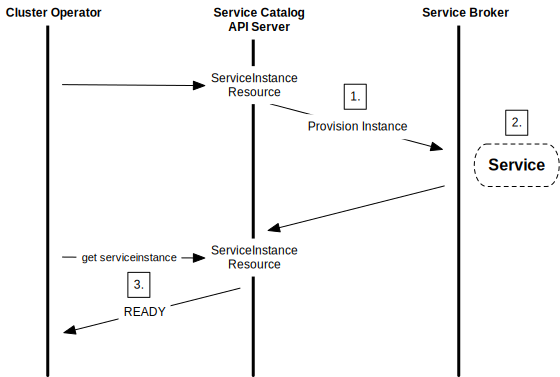

# Service目录

Service目录（Catalog）是一个API扩展，可以让k8s集群中的应用轻松的使用外部的软件，比如一个由云服务商提供的数据存储服务。

它提供了通过[Service Broker](https://v1-18.docs.kubernetes.io/docs/reference/glossary/?all=true#term-service-broker)对外部[托管服务](https://v1-18.docs.kubernetes.io/docs/reference/glossary/?all=true#term-managed-service)进行检索、分配和绑定的方法，且无需了解这些服务是如何创建及管理的。

一个Service Broker，如[开放Service Broker API规范](https://github.com/openservicebrokerapi/servicebroker/blob/v2.13/spec.md)中定义的那样，它是一个接口，包含一组由第三方提供并维护的托管服务，这里的第三方可能是一个云服务商，比如AWS、GCP或者Azure。托管服务可以是Microsoft Azure Cloud Queue、Amazon Simple Queue Service、以及Google Cloud Pub/Sub，可以是任何能为应用提供服务的软件。

使用Service目录，[集群操作员](https://v1-18.docs.kubernetes.io/docs/reference/glossary/?all=true#term-cluster-operator)就可以通过Service Broker来检索托管服务，分配一个托管服务的实例，进行绑定，然后k8s帐的应用就可以使用它了。

## 用法举例

一个[应用开发者](https://v1-18.docs.kubernetes.io/docs/reference/glossary/?all=true#term-application-developer)想在k8s的一个应用中使用消息队列。但是，这位开发者不想自己去部署和管理一个这样的服务，不想操这份儿心。万幸的是，现在有一个云服务商可以通过Service Broker提供一个托管的消息队列服务。

一个集群操作者可以创建Service目录，用它来跟云服务商的Service Broker通信，然后分配一个消息队列的实例，这样k8s集群中的应用就可以使用它了。所以应用开发者就不需要关心消息队列的实现细节了，也不用负责消息队列的管理。应用只需要把它当成一个普通的服务就行了。

## 架构

Service目录使用[开放Service Broker API](https://github.com/openservicebrokerapi/servicebroker)跟Service Broker进行通信，Service Broker为apiserver充当了中间人，协商前期分配，并获取应用使用托管服务时需要的凭证信息。

它被实现成了一个扩展apiserver和一个控制器，使用etcd作为其存储。它还使用了k8s 1.7版本中出现的[聚合层](扩展k8s的API/通过聚合层扩展k8s的API.md)来暴露它的API。


### API资源

Service目录安装了`servicecatalog.k8s.io`API，提供以下k8s资源：

- `ClusterServiceBroker`：Service Broker在集群内的表现形式，封装了它的服务器连接细节。它是由集群操作者创建并管理，后者希望能够通过代理服务器为他们的集群提供新的托管服务。
- `ClusterServiceClass`：由某个Service Broker提供的一个托管服务。当添加了一个新的`ClusterServiceBroker`时，Service目录控制器会连接到这个Service Broker上并获取可用的托管服务列表。然后它会为每一个托管服务创建一个`ClusterServiceClass`资源。
- `ClusterServicePlan`：托管服务的一个特定实现。比如，一个托管服务可能有不同的类型，比如由免费版和付费版的，或者是由不同的配置选项，比如使用SSD存储，或者时拥有更多资源。和`ClusterServiceClass`类似，当添加了一个`ClusterServiceBroker`时，Service目录会为每个托管服务的每个Service Plan创建一个对应的`ClusterServicePlan`资源。
- `ServiceInstance`：一个`ClusterServiceClass`的一个分配好的实例。它们是由集群操作者创建的，是一个托管服务的一个特定实例，可以用于一个或多个集群内的应用。当创建了一个新的`ServiceInstance`时，Service目录控制器会连接到对应的Service Broker并让它分配对应的服务实例。
- `ServiceBinding`：`ServiceInstance`的访问凭证。它们是由集群操作者创建的，集群操作者希望他们的应用能够使用这个`ServiceInstance`。创建之后，Service目录控制器会创建一个k8s`Secret`，包含了Service Instance的连接信息和凭证信息，然后就可以挂载到Pod中了。

### 认证

Service目录支持以下认证方法：

- Basic（用户名/密码）
- [OAuth 2.0 Bearer Token](https://tools.ietf.org/html/rfc6750)

## 用例

集群操作者可以使用Service Catalog API资源来为集群内的应用分配托管服务。分为以下几步：

- 1.通过Service Broker检索可用的托管服务和Service Plan。
- 2.分配托管服务的一个新实例。
- 3.绑定到托管服务，会返回连接凭证。
- 4.将连接凭证映射到应用中。

### 检索托管服务和Service Plan

首先，集群操作者必须要在`servicecatalog.k8s.io`分组中创建一个`ClusterServiceBroker`资源。资源中包含了访问Service Broker接口所需的URL和连接信息。

下面是一个`ClusterServiceBroker`资源的栗子：

```yaml
apiVersion: servicecatalog.k8s.io/v1beta1
kind: ClusterServiceBroker
metadata:
  name: cloud-broker
spec:
  # 指向一个Service Broker的接口 (这里给出的只是个栗子，不能真用。)
  url:  https://servicebroker.somecloudprovider.com/v1alpha1/projects/service-catalog/brokers/default
  #####
  # 其他信息可以放在这里，用来连接到
  # Service Broker，比如bearer token信息或者TLS的证书信息
  #####
```

下面的时序图展示了从Service Broker检索托管服务和Plan的步骤：


- 1.当`ClusterServiceBroker`添加到Service目录后，它会触发调用外部Service Broker，获取可用的服务列表。
- 2.Service Broker返回可用的托管服务列表，以及Service Plan列表，分别缓存在`ClusterServiceClass`和`ClusterServicePlan`资源中。
- 3.然后集群操作者可以通过下面的命令来查看可用的托管服务列表：

```shell script
kubectl get clusterserviceclasses -o=custom-columns=SERVICE\ NAME:.metadata.name,EXTERNAL\ NAME:.spec.externalName
```

它会按照下面的格式列出服务名：

```text
 SERVICE NAME                           EXTERNAL NAME
 4f6e6cf6-ffdd-425f-a2c7-3c9258ad2468   cloud-provider-service
 ...                                    ...
```

还可以通过下面的命令来查看可用的Service Plan：

```shell script
 kubectl get clusterserviceplans -o=custom-columns=PLAN\ NAME:.metadata.name,EXTERNAL\ NAME:.spec.externalName
```

然后它会按照下面的格式列出Plan的名字：

```text
 PLAN NAME                              EXTERNAL NAME
 86064792-7ea2-467b-af93-ac9694d96d52   service-plan-name
 ...                                    ...
```

### 分配一个新的实例

集群操作者可以通过创建一个`ServiceInstance`资源来初始化新实例的分配。

下面是一个`ServiceInstance`资源的栗子：

```yaml
apiVersion: servicecatalog.k8s.io/v1beta1
kind: ServiceInstance
metadata:
  name: cloud-queue-instance
  namespace: cloud-apps
spec:
  # 引用之前返回的服务
  clusterServiceClassExternalName: cloud-provider-service
  clusterServicePlanExternalName: service-plan-name
  #####
  # 其他参数加在这里，
  # Service Broker可能会用到。
  #####
```

下面的时序图展示了托管服务进行新实例分配的步骤：



- 1.当创建了`ServiceInstance`资源后，Service目录会初始化一个外部Service Broker的调用，来分配服务的实例。
- 2.Service Broker创建托管服务的一个新的实例，然后返回一个HTTP响应。
- 3.集群操作者可以检查该实例的状态，看看它是否准备就绪。

### 绑定到托管服务

新的实例分配好之后，集群操作者必须要绑定到托管服务才能获得应用访问服务时需要的连接凭证以及Service Account详情。这一套时通过创建一个`ServiceBinding`资源来完成的。

下面是一个`ServiceBinding`资源的栗子：

```yaml
apiVersion: servicecatalog.k8s.io/v1beta1
kind: ServiceBinding
metadata:
  name: cloud-queue-binding
  namespace: cloud-apps
spec:
  instanceRef:
    name: cloud-queue-instance
  #####
  # 其他参数可以加在这里， 比如一个secretName或者
  # Service Account参数，Service Broker可能会用到。
  #####
```

下面的时序图展示了绑定到托管服务实例所涉及的步骤：


- 1.创建了`ServiceBinding`之后，Service目录会发起外部Service Broker调用，请求绑定对应服务实例所需要的信息。
- 2.Service Broker为对应的Service Account开启应用的权限/角色。
- 3.Service Broker返回连接和访问托管服务实例所需的信息。这些信息时服务商以及服务本身特定的，所以不同服务供应商以及不同的托管服务返回的内容都可能不一样。

### 映射连接凭证

绑定完成后，最后一步就是要把连接凭证映以及服务特定的信息映射到应用中了。这些信息都保存在了应用可以访问的Secret中，用它们就可以直接连接到托管服务上了。


#### Pod配置文件

一种映射方法是使用声明式的Pod配置。

下面的栗子展示了如何将Service Account信息映射到应用中。一个名为`sa-key`的key保存在了一个名为`provider-cloud-key`的数据卷中，应用将这个数据卷挂载到了`/var/secrets/provider/key.json`上。然后还有一个环境变量`PROVIDER_APPLICATION_CREDENTIALS`，它的值就是挂载的文件。

```yaml
...
    spec:
      volumes:
        - name: provider-cloud-key
          secret:
            secretName: sa-key
      containers:
...
          volumeMounts:
          - name: provider-cloud-key
            mountPath: /var/secrets/provider
          env:
          - name: PROVIDER_APPLICATION_CREDENTIALS
            value: "/var/secrets/provider/key.json"
```

下面的栗子展示了如何将Secret的值映射到应用的环境变量上。在这里，消息队列的topic名字是从一个名为`provider-queue-credentials`的Secret中的一个名为`topic`的key上映射到了环境变量`TOPIC`中。

```yaml
...
          env:
          - name: "TOPIC"
            valueFrom:
                secretKeyRef:
                   name: provider-queue-credentials
                   key: topic
```

## 下一步……

- 如果你熟悉[Helm Chart](https://helm.sh/docs/topics/charts/)，[使用Helm安装Servicem目录](https://v1-18.docs.kubernetes.io/docs/tasks/service-catalog/install-service-catalog-using-helm/)到你的k8s集群中。或者你还可以[用SC工具安装Service目录](https://v1-18.docs.kubernetes.io/docs/tasks/service-catalog/install-service-catalog-using-sc/)。
- 看看[Service Broker栗子](https://github.com/openservicebrokerapi/servicebroker/blob/master/gettingStarted.md#sample-service-brokers)。
- 了解一下[kubernetes-incubator/service-catalog](https://github.com/kubernetes-sigs/service-catalog)项目。
- 看以下[svc-cat.io](https://svc-cat.io/docs/)。