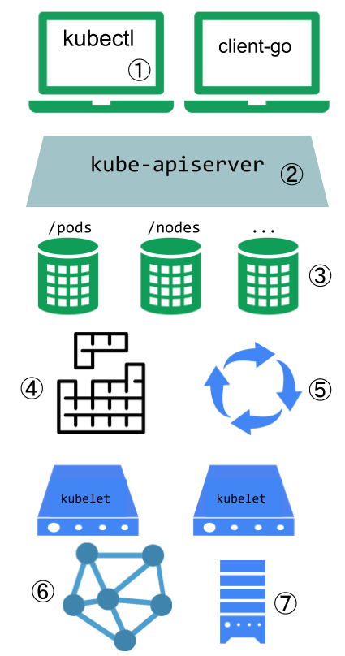
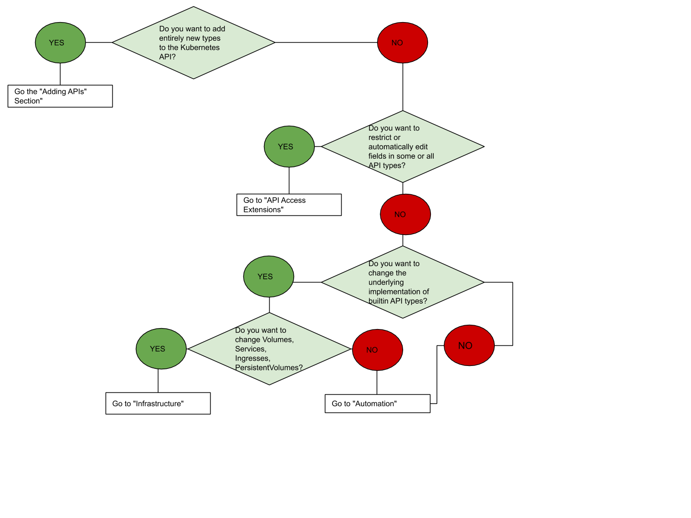

# 扩展你的k8s集群

k8s是高度可配置、可扩展的。因此一般都不需要对k8s的代码做fork或者提交补丁。

本文将介绍可以自定义k8s集群的各种方法。主要提供给那些[集群操作者](https://v1-18.docs.kubernetes.io/docs/reference/glossary/?all=true#term-cluster-operator)，想让k8s集群能够适配他们当前的环境。做k8s[平台开发](https://v1-18.docs.kubernetes.io/docs/reference/glossary/?all=true#term-platform-developer)或k8s项目的[贡献者](https://v1-18.docs.kubernetes.io/docs/reference/glossary/?all=true#term-contributor)们同样可以从本文得到帮助，了解存在哪些扩展点和扩展模式，以及相关的利弊权衡与限制。

## 概要

进行自定义的方法可以大体上分为*配置*，只需要修改参数、本地配置文件或者API资源；和*扩展*，需要运行额外的程序或服务。本文主要介绍的是扩展。

## 配置

*配置文件*和*参数*在每个二进制文件对应的在线参考文档中都有介绍：

- [kubelet](https://v1-18.docs.kubernetes.io/docs/reference/command-line-tools-reference/kubelet/)
- [kube-apiserver](https://v1-18.docs.kubernetes.io/docs/reference/command-line-tools-reference/kube-apiserver/)
- [kube-controller-manager](https://v1-18.docs.kubernetes.io/docs/reference/command-line-tools-reference/kube-controller-manager/)
- [kube-scheduler](https://v1-18.docs.kubernetes.io/docs/reference/command-line-tools-reference/kube-scheduler/)。

如果k8s是托管的或者安装受控，参数和配置文件可能没法改。如果能改的话，一般也都是只能让集群管理员去改。而且，这些内容在之后的版本中可能会发生变化，而且修改的话可能还要重启相关的进程。出于这些原因吧，这么做只能属于下下策。

*内置策略API*，比如[ResourceQuota](../策略/资源配额.md)、[PodSecurityPolicy](../策略/Pod安全策略.md)、[NetworkPolicy](../Service，负载均衡，网络/网络策略.md)，以及角色访问控制（[RBAC](https://v1-18.docs.kubernetes.io/docs/reference/access-authn-authz/rbac/)），都是内置的k8s API。在托管的k8s或者安装受控的情况下一般都会使用API。它们都是声明式的，规范都跟其他的k8s资源比如Pod差不多，所以，新集群配置可以重复操作，而且可以像应用一样进行管理。再而且吧，当它们稳定之后，可以像其他k8s的API一样享受到[既定的支持策略](https://v1-18.docs.kubernetes.io/docs/reference/using-api/deprecation-policy/)。出于这些原因吧，同样的情况下要比*配置文件*和*参数*更加方便。

## 扩展

扩展（Extension）是软件组件，扩展的同时也深度集成到了k8s中。它们通过自身的适配，可以支持新的类型以及新的硬件种类。

大部分集群管理员用的都是托管或者发行版的k8s实例。因此大部分k8s用户不需要安装扩展，而且也不需要创造什么新的扩展。

## 扩展模式

k8s从设计上支持编写客户端程序然后自动运转。任何读写k8a API的程序都可以提供有意义的自动化机制。*自动化*可以在集群上运行，也可以脱离集群。按照本文的指引，你就可以写出高可用、健壮的自动化机制。自动化一般都可以运行在各种k8s集群上，包括托管集群和受控安装。

写这种跟k8s配合良好的客户端程序是有特定模式的，叫做*控制器（Controller）* 模式。控制器一般要读取一个对象的`.spec`，然后搞点儿事情，然后再更新对象的`.status`。

一个控制器就是一个k8s的客户端。如果是k8s作为客户端，调用一个外部的远程服务，那它就叫*Webhook*。对应的远程服务叫做*Webhook Backend*。跟控制器类似，Webhook也会引入失败点（point of failure）。

在webhook模式中，k8s要向远程服务发起一个网络请求。在*二进制插件（Binary Plugin）* 模式中，k8s要执行一个二进制文件（程序）。二进制插件会用于kubelet（比如[Flex数据卷插件](../存储/数据卷.md#FlexVolume)和[网络插件](计算，存储与网络拓展/网络插件.md)）以及kubectl。

下图展示了扩展点如何跟k8s的控制面进行交互。

## 扩展点

此图展示了k8s中的扩展点。

1.用户经常用`kubectl`跟k8s的API打交道。[kubectl插件](https://v1-18.docs.kubernetes.io/docs/tasks/extend-kubectl/kubectl-plugins/)扩展了kubectl的二进制。它影响的只是某个用户的本地环境，不会影响整体的策略。 
2.apiserver处理所有请求。在apiserver中有几种不同类型的扩展点，可以进行请求认证，基于请求的内容拒绝请求、编辑内容、处理删除。这些详见[API访问扩展（API Access Extension）](#API访问扩展)一节。 
3.apiserver处理各种各样的*资源*。*内置资源类型*，比如`pod`，是由k8s项目本身来定义的，无法更改。你可以添加你自定义的资源，或者由其他项目定义的资源，我们称其为*自定义资源（Custom Resource）*，详见[Custom Resource](#用户定义类型)。自定义资源通常和API访问扩展一起使用。 
4.k8s调度器决定了Pod要放到哪个节点上。有很多种方式来扩展调度行为。详见[调度器扩展](#调度器扩展)。 
5.k8s的大部分行为都实现在了称为控制器（Controller）的程序中，而它也是apiserver的客户端。控制器一般是跟自定义资源一起用（Custom Resource）。 
6.kubelet运行在服务器上，让Pod看起来像是虚拟服务器一样，在集群网络中有自己的一个IP。[网络插件](#网络插件)可以实现不同的Pod网络。 
7.kubelet还为容器进行数据卷的挂载和卸载。可以通过[存储插件](#存储插件)支持新的存储类型。

如果你不清楚从哪开始捋，看看下面的流程图吧。其中有些方案涉及到多种扩展点。

## API扩展

### 用户定义类型

如果你想定义新的控制器、应用配置对象或者其他声明式API，那就考虑添加一个自定义资源（Custom Resource），使用类似`kubectl`这样的工具对它们进行管理。

不要拿自定义资源作为应用、用户或监控数据的数据存储。

自定义资源详见[自定义资源](扩展k8s的API/自定义资源.md)。

### 新API和自动化

将一个自定义资源和一个控制循环结合起来，称为[Operator模式](Operator模式.md)。Operator模式用来管理特定的，通常是有状态的应用。这些自定义API和控制循环还可以用来控制其他资源，比如存储或策略。

### 修改内置资源

当你通过添加自定义资源来扩展k8s的API的时候，这些新的资源都会被划分到一个新的API组中。你无法替换或者修改已经存在的API组。添加一个API并不会直接影响已存在的API（比如Pod）的行为，但是API访问扩展（API Access Extension）可以做到。

### API访问扩展

当一个请求到达apiserver的时候，首先要进行认证，然后是授权，然后要受控于各种类型的准入控制（Admission Control）。这部分详见[控制API的访问](https://v1-18.docs.kubernetes.io/docs/reference/access-authn-authz/controlling-access/)。

这里面的每一步都有扩展点。

k8s支持若干个内置的认证方法。当然它还可以置于某个认证代理的后面，还可以为远程服务发送包含token的认证header（比如webhook），方便进行验证。这些方法的介绍都在[认证](https://v1-18.docs.kubernetes.io/docs/reference/access-authn-authz/authentication/)中。

### 认证

[认证](https://v1-18.docs.kubernetes.io/docs/reference/access-authn-authz/authentication/)是将所有请求的header或证书映射到发送该请求的用户名上。

k8s提供了若干个内置的认证方法，如果还不满足的话，它还有一个[认证webhook](https://v1-18.docs.kubernetes.io/docs/reference/access-authn-authz/authentication/#webhook-token-authentication)方法。

### 授权

[授权](https://v1-18.docs.kubernetes.io/docs/reference/access-authn-authz/webhook/)判定该用户是否可以读、写或者对API资源做其他操作。它仅工作在整体资源层面上——不根据对象字段做区分。如果内置的授权机制不满足你的需要，[授权webhook](https://v1-18.docs.kubernetes.io/docs/reference/access-authn-authz/webhook/)可以调用外部的用户代码来进行授权决策。

### 动态准入控制

请求授权后，如果它是一个写操作，那就还要经过[准入控制](https://v1-18.docs.kubernetes.io/docs/reference/access-authn-authz/admission-controllers/)。除了内置的几个步骤外，有以下扩展：

- [镜像策略webhook](https://v1-18.docs.kubernetes.io/docs/reference/access-authn-authz/admission-controllers/#imagepolicywebhook)用来限制哪些镜像可以运行在容器中。
- 要想做任意的准入控制决策，可以使用[准入webhook](https://v1-18.docs.kubernetes.io/docs/reference/access-authn-authz/extensible-admission-controllers/#admission-webhooks)。准入webhook可以拒绝创建或更新操作。

## 基础扩展

### 存储插件

[Flex数据卷](https://github.com/kubernetes/community/blob/master/contributors/design-proposals/storage/flexvolume-deployment.md)让Kubelet调用一个二进制插件来挂载数据卷，允许用户挂载数据卷类型且无需内置的支持。

### 设备插件

设备插件允许节点通过[设备插件](计算，存储与网络拓展/设备插件.md)来发现新的节点资源（除了内置的CPU和内存等资源）。

### 网络插件

可以通过节点级的[网络插件](计算，存储与网络拓展/网络插件.md)实现不同的网络。

### 调度器扩展

调度器是一种特殊类型的控制器，它监视Pod，将Pod安置到节点上。默认的调度器可以整体替换掉，继续使用其他的k8s组件，或者还可以同时运行[多个调度器](https://v1-18.docs.kubernetes.io/docs/tasks/extend-kubernetes/configure-multiple-schedulers/)。

这可是个大事儿，几乎所有的k8s用户都觉得他们用不着修改调度器。

调度器还可以支持[webhook](https://github.com/kubernetes/community/blob/master/contributors/design-proposals/scheduling/scheduler_extender.md)，允许其他服务（调度器扩展）来对Pod的节点进行过滤和优先级制定。

## 下一步……

- 看看[自定义资源](扩展k8s的API/自定义资源.md)
- 了解下[动态准入控制](https://v1-18.docs.kubernetes.io/docs/reference/access-authn-authz/extensible-admission-controllers/)
- 学学基础扩展
    - [网络插件](计算，存储与网络拓展/网络插件.md)
    - [设备插件](计算，存储与网络拓展/设备插件.md)
- 看看[kubectl插件](https://v1-18.docs.kubernetes.io/docs/tasks/extend-kubectl/kubectl-plugins/)
- 了解下[Operator模式](Operator模式.md)