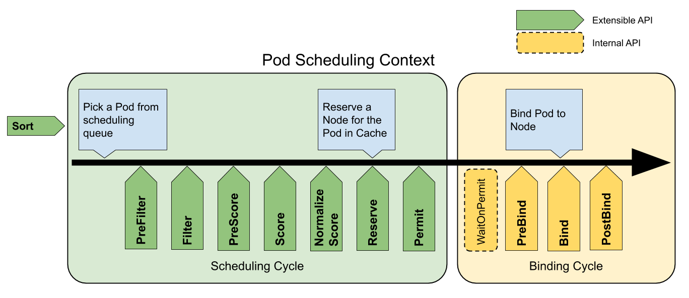

# 调度框架

**功能状态**：`Kubernetes v1.15 [alpha]`

调度框架是k8s调度器的一个可插拔组件，可以让调度器的自定义更加简单。它给已经存在的调度器增加了一组新的“插件”API。插件是被编译到调度器中的。这套API可以让大部分调度特性实现成插件，保证调度的“核心”更简单更容易维护。关于这套框架的更多技术细节可以去看[调度框架的设计方案](https://github.com/kubernetes/enhancements/blob/master/keps/sig-scheduling/20180409-scheduling-framework.md)。

# 框架工作流

调度框架定义了一些扩展点。调度器插件注册器可以在一个或多个扩展点上调用。其中一些插件可以改变调度的决策，另一些则只是提供一些信息。

对Pod的每一次调度都要分成两个阶段，**调度周期（scheduling cycle）**和**绑定周期（binding cycle）**。

## 调度周期和绑定周期

调度周期是要给Pod选择一个节点，绑定周期是要将决策应用到集群上。二者合二为一，一个调度周期加绑定周期，称为“调度上下文（scheduling context）”。

调度周期是顺序执行的，绑定周期则可以并发执行。

如果发现Pod无法被调度，或者发生内部错误，调度或绑定周期都是可以被中止的。Pod会被打回到队列中并进行重试。

## 扩展点

下图展示了一个Pod的调度上下文，以及调度框架暴露出来的扩展点。图中的“Filter”即为“Predicate”，“Scoring”即为“优先级函数”。

一个插件可以注册到多个扩展点上，实现更复杂或者有状态的任务。

调度框架扩展点

### 队列排序（QueueSort）

这些插件用来在调度队列中对Pod进行排序。一个队列排序插件本质上就是要提供一个`Less(Pod1, Pod2)`函数。一次只能启用一个队列排序插件。

### PreFilter

这些插件用来预处理Pod信息，或者检查某些集群或Pod必须满足的条件。如果PreFilter插件返回一个错误，调度周期中止。

### Filter

这些插件将不能用来运行Pod的节点过滤掉。对于每个节点，调度器会按照配置的顺序调用过滤器插件。如果某个过滤器插件将该节点标记为不合适，那就不会再对该节点调用剩下的插件了。允许并发地对节点进行过滤处理。

### PreScore

这些插件用来做“预打分”，为Score插件生成一个可共享的状态。如果PreScore插件返回了一个错误，调度周期中止。

### Score

这些组件对过滤后的节点进行排序。调度器对每个节点调用每一个打分插件。这里会有一个定义良好的整数范围，表示分值的最大最小值。在[NormalizeScore](#NormalizeScore)阶段之后，调度器会根据配置好的插件权重整合所有插件得出的分值。

### NormalizeScore