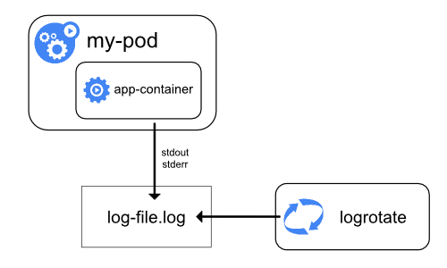

# 日志架构

应用和系统日志可以让你知道集群里正在发生的事儿。日志对于调试和监控集群活动都是非常有用的。现在大部分的应用都有一定的日志机制；因此，大部分的容器引擎也设计了某种程度的日志支持。对于容器化应用来说，最简单同时也是接受程度最高的日志记录方法就是把日志打到标准输出和标准错误流上。

但是容器引擎或运行时提供的原生功能并不足以形成一个完整的日志解决方案。比如，如果容器崩了，Pod被踢掉了，或者节点完犊子了，但是你可能仍然希望能看到应用的日志。所以日志的存储和声明周期应当是独立于节点、Pod或容器。我们把这个概念叫做*集群日志（cluster-level-logging）*。集群日志需要单独的后端来存储、分析和查询日志。k8s并没有提供原生的日志数据存储方案，但是你可以集成很多已有的日志方案到集群中来。

我们这里讲集群日志架构的时候，首先会假设已经有一个日志后端服务部署在你的集群中或者集群外部了。如果你对集群日志没兴趣，在这里仍然会了解到日志是如何在节点本地存储和处理的，也是蛮有用的知识点。

## k8s的日志

在这一节中，呢会看到一个关于k8s日志的基本的栗子，它把数据输出到了标准输出流上。这个栗子用了一份[Pod定义](https://v1-18.docs.kubernetes.io/examples/debug/counter-pod.yaml)，里面包含了一个容器，每秒钟向标准输出写入一些文本。

```yaml
apiVersion: v1
kind: Pod
metadata:
  name: counter
spec:
  containers:
  - name: count
    image: busybox
    args: [/bin/sh, -c,
            'i=0; while true; do echo "$i: $(date)"; i=$((i+1)); sleep 1; done']
```

运行下面的命令把这个Pod跑起来：

```shell script
kubectl apply -f https://k8s.io/examples/debug/counter-pod.yaml
```

输出如下：

```text
pod/counter created
```

要想看日志，用`kubectl logs`命令：

```shell script
kubectl logs counter
```

输出：

```text
0: Mon Jan  1 00:00:00 UTC 2001
1: Mon Jan  1 00:00:01 UTC 2001
2: Mon Jan  1 00:00:02 UTC 2001
...
```

可以在`kubectl logs`命名上加上`--previous`选项，可以看到之前容器实例的日志，以防容器挂掉。如果Pod中包含了多个容器，那就把你想看的容器名字加到命令后面。详见[`kubectl logs`文档](https://v1-18.docs.kubernetes.io/docs/reference/generated/kubectl/kubectl-commands#logs)。

## 节点上的日志



每个容器应用写到`stdout`和`stderr`的数据都被容器引擎处理并重定向到其他地方。比如Docker就会把这两个流重定向到[一个日志驱动](https://docs.docker.com/config/containers/logging/configure/)，k8s把它配置成按照JSON格式写入到一个文件中。

>**注意**：Docker的json日志驱动会把每一行作为一条单独的消息。当你用Docker日志驱动的时候，没有直接支持多行消息的方法。你需要在日志代理层或者更高的层次上处理多行消息。

默认情况下，如果容器重启，kubelet会保留一个结束的容器跟它的日志。如果Pod从这个节点上被踢掉了，所有对应的容器都会被踢掉，连同它们的日志。

在节点级别的日志管理中，一个很重要的事儿就是日志的滚动（rotation），这样日志才不会把所有的存储空间都吃掉。k8s目前是不管日志滚动的事儿的，但是部署工具应当有这方面的功能。比如用`kube-up.sh`部署的k8s集群，会有一个[`logrotate`](https://linux.die.net/man/8/logrotate)工具，每小时运行一次。或者你也可以配置一下容器运行时，让它来自动滚动应用的日志，比如用Docker的`log-opt`。在`kube-up.sh`脚本中，后者用于GCP上的COS镜像，前者用于其他环境。不论是哪种情况，当日志文件超过10MB的时候默认都会发生日志滚动。

在对应的[脚本](https://github.com/kubernetes/kubernetes/blob/v1.18.8/cluster/gce/gci/configure-helper.sh)中你可以找到关于`kube-up.sh`如何为GCP上的COS镜像部署日志记录功能的详细信息。

当你在上面的栗子中使用[`kubectl logs`](https://v1-18.docs.kubernetes.io/docs/reference/generated/kubectl/kubectl-commands#logs)的时候，节点上的kubelet会处理相应的请求，直接读取日志文件，把内容返回来。

>**注意**：目前来说，如果有外部系统做了日志的滚动，那么在`kubectl logs`命令中就只能看到最后一个日志文件的内容。比如出现了一个10MB的文件，`logrotate`做了滚动，然后出现了两个文件，一个10MB一个空的，此时执行`kubectl logs`就什么也看不到。

### 系统组件日志

有两类系统组件：运行在容器中的，以及不运行在容器中的。比如：

- k8s调度器和kube-proxy是运行在容器中的。
- kubelet和容器运行时，比如Docker，不是运行在容器中的。

如果主机有systemd，kubelet和容器运行时会把日志写到journald。如果没有systemd，则会写到`/var/log`目录的`.log`文件中。容器中运行的系统组件总是会写到`/var/log`目录中，绕过了默认的日志机制。它们用的是[klog](https://github.com/kubernetes/klog)日志库。可以在[日志开发文档](https://github.com/kubernetes/community/blob/master/contributors/devel/sig-instrumentation/logging.md)中找到这些组件记录日志时关于日志级别的约定。

和容器日志类似，`/var/log`目录中的系统组件的日志也需要滚动。如果是用`kube-up.sh`脚本部署的k8s集群，这些日志会被`logrotate`工具进行每天一次的滚动处理，或者是文件大小超过100MB的时候。

## 集群日志架构

虽然k8s没有提供原生的集群日志方案，但是有很多常用的方法你都可以考虑采纳。这里给出几种方法：

- 每个节点运行一个节点级别的日志代理。
- 在应用Pod中包含一个sidecar容器来做日志记录。
- 在应用中直接把日志推到日志服务上。

### 使用节点日志代理


可以在每个节点上引入一个*节点级别的代理*来实现集群日志。日志代理是一个专用工具，负责暴露或将日志推到日志服务上。一般来说，节点代理也是运行在容器中，并且能够访问所在节点的所有应用容器的日志目录。

因为日志代理必须要运行在每个节点上，所以经常实现成一个DaemonSet副本，或者是专用的Pod，再或者是节点本地的普通进程。但是后两种方法都废弃了，非常不建议用。

使用节点级别的日志代理在k8s中时最为常用和推荐使用的方法，因为它只会在每个节点创建一个代理，不需要对节点上的应用Pod做任何的修改。但是，这个但是很重要，节点级别的日志*只能处理应用的标准输出和标准错误*。

k8s本身不会定义日志代理，但是k8s中打包了两个可选的日志代理：[Stackdriver](https://v1-18.docs.kubernetes.io/docs/tasks/debug-application-cluster/logging-stackdriver/)，用于GCP，以及[Elasticsearch](https://v1-18.docs.kubernetes.io/docs/tasks/debug-application-cluster/logging-elasticsearch-kibana/)。可以在它们各自的文档中查看更多细节。它们都是用[fluentd](https://www.fluentd.org/)加一些自定义的配置来做节点代理。